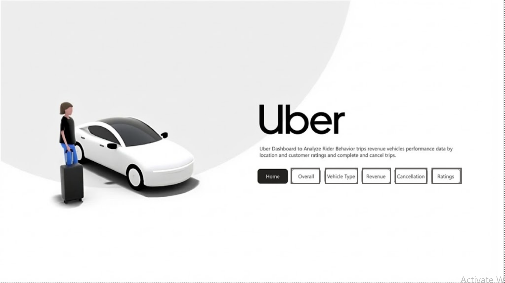
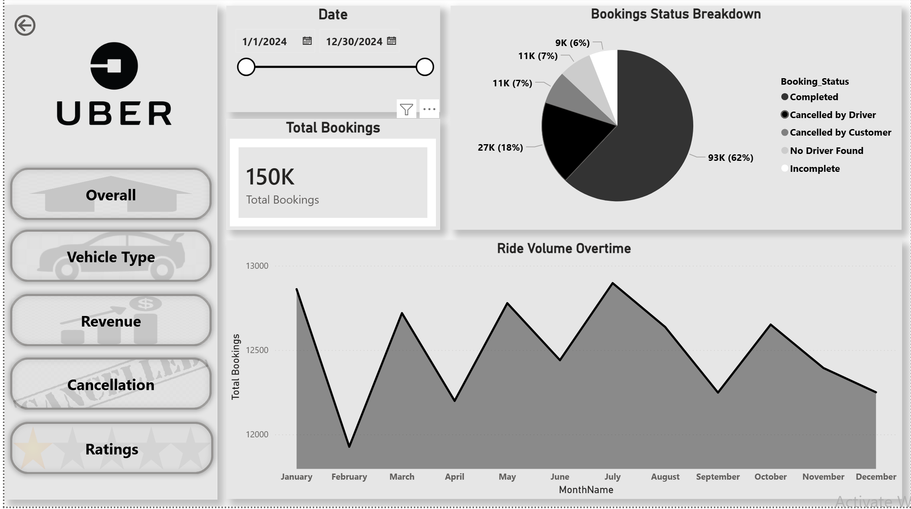
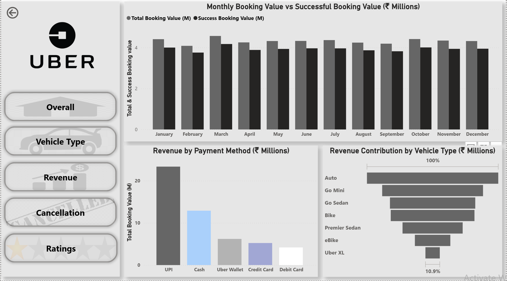
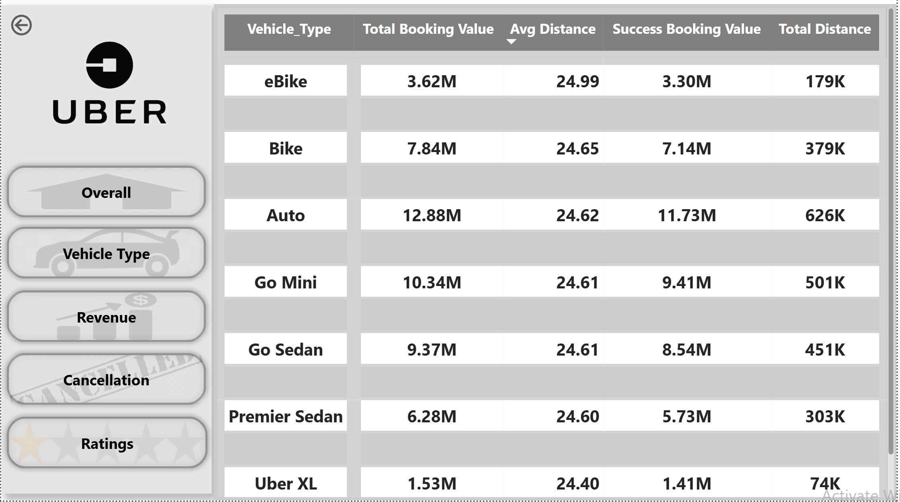
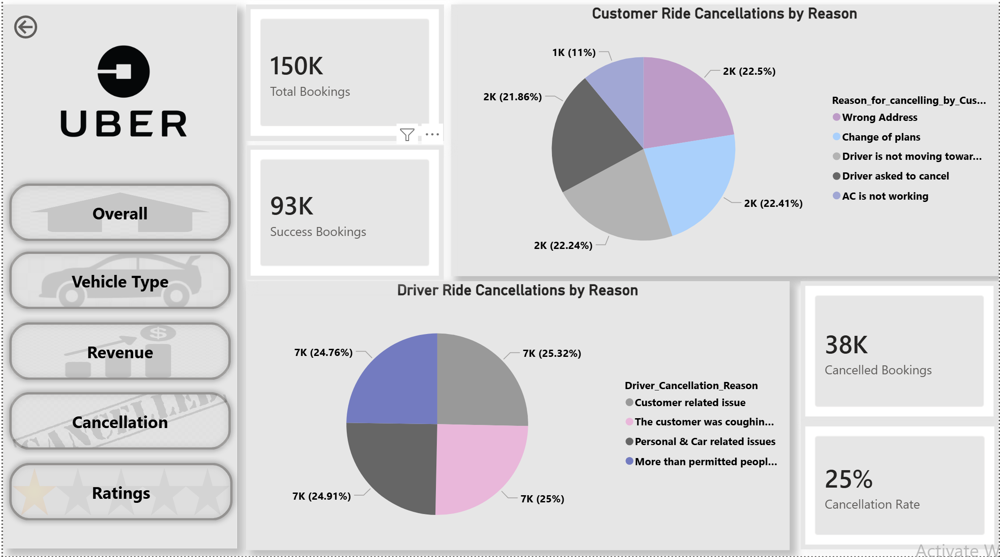
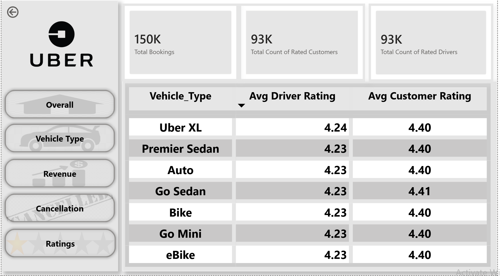

# Uber NCR Ride Analysis 🚖📊

End-to-end **SQL & Python-based data analysis** of ride bookings in the NCR region, focusing on **demand patterns, cancellations, revenue trends, and operational KPIs**.
The project simulates a real-world ride-hailing analytics use case with a strong emphasis on **data quality, business insights, and dashboard storytelling**.

---

## 📌 Project Objectives

* Analyze ride demand and booking behavior across time, locations, and vehicle types
* Identify **cancellation drivers** (customer vs driver)
* Evaluate **revenue, ratings, and operational efficiency**
* Build **decision-ready dashboards** for business stakeholders

---

## 🗂️ Project Structure

```
uber-ncr-ride-analysis/
│
├── data/
│   ├── raw/              # Original booking datasets
│   └── processed/        # Cleaned & feature-engineered data
│
├── sql/                  # SQL audit & data cleaning scripts
├── notebooks/            # Python EDA & audit notebooks
│
├── visuals/
│   ├── dashboard_images/ # Power BI dashboard screenshots
│   ├── powerbi/          # Power BI (.pbix) file
│   └── report_presentation/ # Business presentation (PPT)
│
├── assets/               # Logos & reference images
└── README.md
```

---

## 🛠️ Tools & Technologies

* **SQL** – Data auditing, validation, and cleaning
* **Python** (Pandas, NumPy, Matplotlib) – EDA & preprocessing
* **Power BI** – Interactive dashboards & KPI reporting
* **Excel** – Data inspection & exports

---

## 📊 Power BI Dashboards

### 🏠 Home Overview



---

### 📈 Overall Metrics



---

### 💰 Revenue Analysis



---

### 🚗 Vehicle Type Performance



---

### ❌ Cancellation Analysis



---

### ⭐ Ratings Analysis



---

## 🔍 Key Insights

* Peak ride demand observed during **office hours and evening time slots**
* **Customer-side cancellations** dominate short lead-time bookings
* Certain vehicle categories show **higher revenue but lower ratings**
* Cancellation reasons directly impact **driver efficiency & customer experience**

---

## 📁 Additional Resources

* 📌 **SQL Scripts** → `sql/`
* 📌 **Python Notebooks (EDA & Audit)** → `notebooks/`
* 📌 **Power BI File** → `visuals/powerbi/`
* 📌 **Business Presentation** → `visuals/report_presentation/`

---

## 👤 Author

**Abhinandh O**
Aspiring Data Analyst | SQL • Python • Power BI
[LinkedIn](https://www.linkedin.com/in/abhinandh-o-143016348)

---

